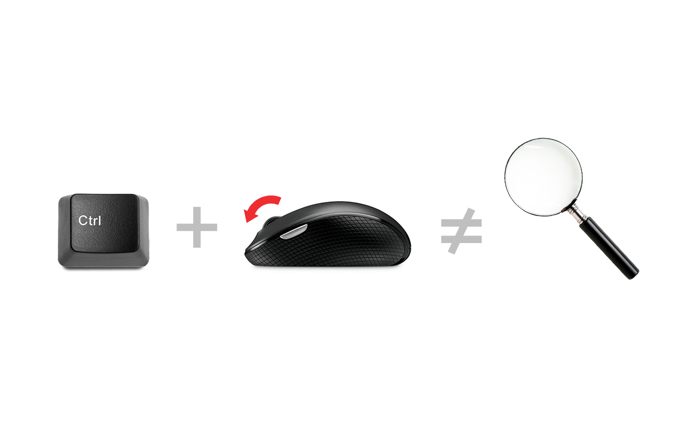

### BookmarkNest 📚🏠

BookmarkNest is a Chrome extension that allows you to easily save and organize your bookmarks either in the cloud or locally.

You can try out the extension on the [Chrome Web Store](https://chromewebstore.google.com/detail/bookmarknest_extension_id?hl=en&authuser=1).
 

#### Description

BookmarkNest is a Chrome extension that simplifies the bookmarking process. It provides an intuitive interface for saving and managing bookmarks directly from your browser. Whether you prefer to keep your bookmarks synced in the cloud or store them locally, BookmarkNest has got you covered.

#### Features

- Save bookmarks effortlessly.
- Organize bookmarks with ease.
- Cloud synchronization for access from anywhere.
- Optional local storage for privacy and security.

#### Installation

To install BookmarkNest, follow these steps:
1. Download the extension files.
2. Open Chrome and go to `chrome://extensions`.
3. Enable "Developer mode" at the top-right corner.
4. Click on "Load unpacked" and select the downloaded extension folder.

#### Contributing

Contributions are welcome! If you have any suggestions, bug reports, or feature requests, please submit a pull request or open an issue on GitHub.

#### License

This project is licensed under the BSD 3-Clause License - see the [LICENSE](LICENSE) file for details.

Tags: bookmarks, bookmarking, save, organize, cloud, local storage

